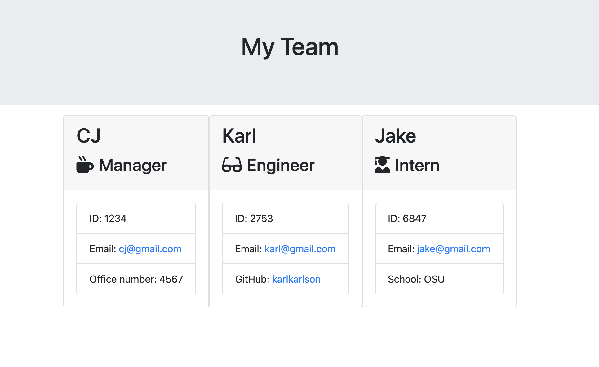

# employee-html-generator

## Description
This is a program using node.js from the command line that allows you to generate HTML for a team of employees from simple user input. Different employees and different information are made available for input, then are written to an HTML file named 'team.html' in a separate folder named 'output'. This program is an exercise in Object Oriented Programming (OOP) where the different employe types are children of the employee object.

## Installation
Download the files and open them in a new terminal window. 
Use `npm init` to initialize, then `npm install` to get inquirer and other dependencies. Then run `node app.js`

## Usage
Link to video running project from the command line: https://drive.google.com/file/d/1O_q4GGF4zsReBbIlu7o4Gn9Ohgy8T-1X/view

## Credits
Code by CJ Hansen: https://github.com/cjrhansen2
